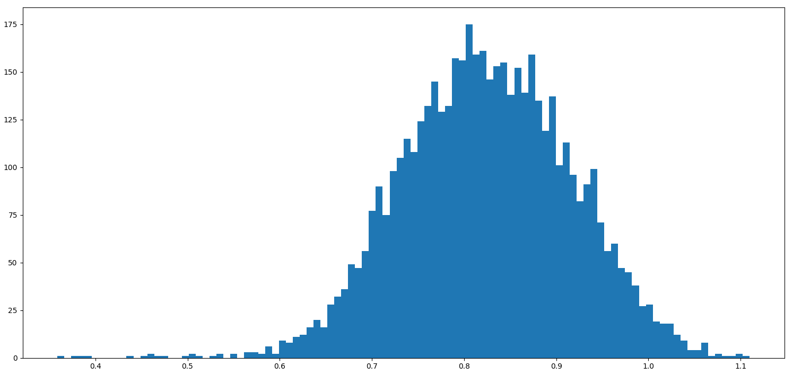
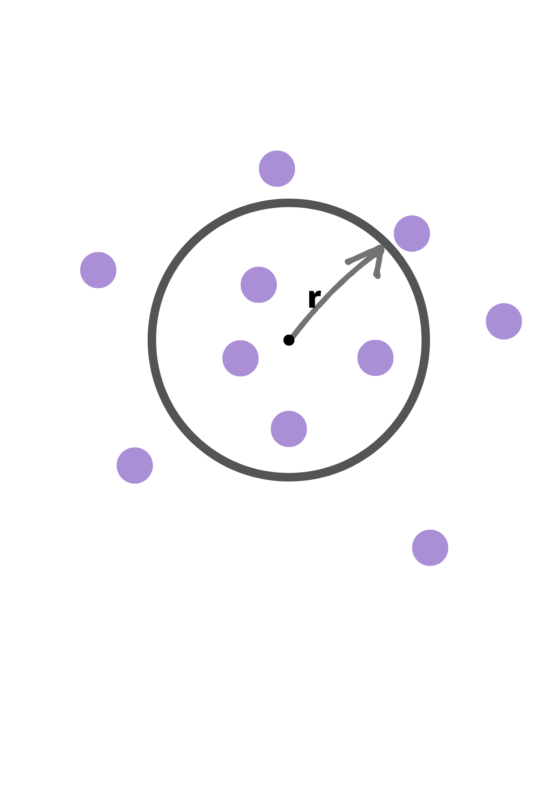
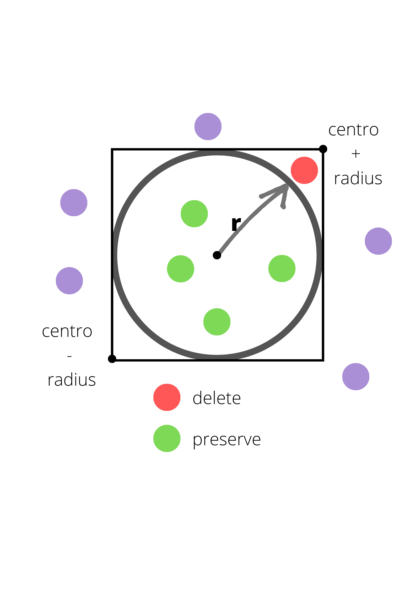
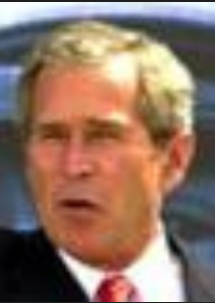
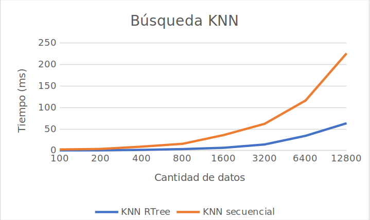
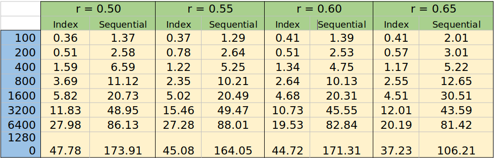
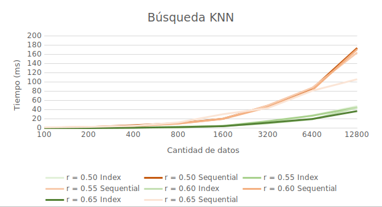

# Proyecto 3 del curso de Base de datos II
# Face Recognition

## **Integrantes**
* Calixto Rojas, Neftali 
* Carlos Acosta, Rodrigo Dion
* Hilares Barrios, Salvador Eliot
* Angeles Barazorda, JeanPier

## **Tabla de contenido**
* [Introducción](#introducción)
* [Librerías usadas](#librerías-usadas)
  * [Face Recognition](#face-recognition)
  * [Rtree](#rtree)
* [Implementación](#implementación)
    * [Backend](#Backend)
      * [Procesamiento de imágenes](#procesamiento-de-imágenes)
      * [Indexación de vectores característicos](#indexación-de-vectores-característicos)
      * [Búsqueda por rango y KNN secuencial](#búsqueda-por-rango-y-knn-secuencial)
      * [Búsqueda por rango y KNN con el RTree](búsqueda-por-rango-y-knn-con-el-rtree)

    * [Frontend](#Frontend)
      * [HTML y CSS](#html-y-css)
      * [Bootstrap](#bootstrap)
      * [JavaScript](#javascript)
* [Experimentación](#experimentación)
  * [Búsqueda KNN](#búsqueda-KNN)
  * [Búsqueda por rango](#búsqueda-por-rango)
* [Análisis y discusión](#análisis-y-discusión)
* [Presentacion](#Demo)

# Introducción
El reconocimiento de rostros es una tecnología que pertenece al campo de visión del computador. Su investigación radica no solo en reconocer cuando una imagen contiene algún rostro, sino también a reconocer la identidad del rostro encontrado. En este proyecto utilizaremos librerías relacionadas con procesamiento de imágenes e indexamiento para crear un pequeño motor de búsqueda de rostros.
Por ende, este proyecto está enfocado al uso de una estructura multidimensional para dar soporte a las búsquedas y 
recuperación eficiente de imágenes en un servicio web de reconocimiento facial. 
# Librerías usadas

## Face Recognition
Esta librería permite reconocer un rostro en una imagen y generar un vector característico de 128 dimensiones Este vector es la representación matemática de un rostro, el cual puede comparar con los vectores característicos de otros rostros y determinar la similitud entre ellos. En nuestro proyecto, utilizaremos esta librería para obtener el vector característico tanto de las fotos de una base de datos como de la imagen cargada a través del motor de búsqueda.

## Rtree
Esta librería implementa un RTree funcional con el cual indexaremos los vectores característicos obtenidos por la anterior librería. La ventaja de utilizar esta estructura radica en que las búsquedas por rango y KNN están optimizadas.

# Implementación

# Backend
## Procesamiento de imágenes
Debido a la cantidad de datos (casi 13000 imágenes), este proceso se realiza en el programa photoEncodingGeneration.py. Para cada imagen de la base de datos se obtiene su vector característico de 128 dimensiones. Este vector se guarda en un diccionario con clave igual al vector en forma de tupla y con valor igual a la dirección de donde se encuentra la imagen. Este diccionario se guarda en el archivo data.json.

Luego, realizamos un procesamiento de los vectores para determinar la distribución de distancias entre ellos en el archivo ~ `processing.py`. Para esto, se escoge un par de vectores aleatorios y se calcula la distancia entre ellos, esta operación se realiza unas 5000 veces, y el histograma obtenido es el siguiente.

## Indexación de vectores característicos
Con la información obtenida, implementaremos nuestra clase Comparator.py, el cual implementará las funciones necesarias para obtener la información, así como su indexación con un RTree. En el constructor cargamos dos diccionarios:

> dict128VectorPhotos: Tiene como clave al vector, y valor a la dirección de su imagen en la base de datos.

> dictPhotos: Tiene como clave a un nombre, y valor a una lista de vectores correspondientes con sus fotos.

Además, se crea un vector con todos los vectores característicos para insertarlos en el RTree, el cual representará a toda nuestra colección de datos. Primero, debemos configurar el RTree para que trabaje con 128 dimensiones. Luego insertamos todos los vectores característicos.

## Búsqueda por rango y KNN secuencial
Estas búsquedas son implementadas a partir de la colección de datos, como vimos en clase, la búsqueda por rango compara todos los datos de la colección con la query, y retorna los que se encuentren dentro del radio de búsqueda, y tiene una complejidad `O(n*d)`.

La búsqueda KNN utiliza un priority queue y retorna los K vecinos más cercanos al query, y tiene una complejidad `O(n*(lgk + d))`. Para nuestro proyecto, d es igual a 128, por lo que podemos quitarlo de las complejidades por ser constante. 

## Búsqueda por rango y KNN con el RTree
La búsqueda por rango en el RTree requiere de dos puntos que representan un MBR, y retorna los puntos que se encuentren en él. Para adaptarlo a nuestra implementación, debemos crear este MBR a partir del vector característico de búsqueda, sumando y restando el radio a sus 128 dimensiones. Luego, cuando retorne los resultados, debemos descartar los que se encuentren fuera del radio de cobertura, además de ordenarlo por distancia ya que no los trae ordenados.

  
   

La búsqueda KNN en el RTree funciona como se espera, por lo que no es necesario realizar alguna modificación como con la búsqueda por rango.

# Frontend
En el front end encontramos dos páginas, una para la búsqueda de la imagen y la otra que muestra los resultados acorde a la query enviada.

## HTML y CSS
Se utilizó para las estructuras básicas de las páginas y los envíos de las querys. Además, dentro de la estructura encontramos el llamado a las funciones de Python que realizan la consulta y devuelven el resultado.

## Bootstrap
Se utilizó para las cards en las que se muestran los resultados, por lo que forma parte de la estetica de la página.
 

## Javascript
Se utilizó para la previsualización de la imagen al momento de elegir una para realizar la consulta. En otras palabras, que la imagen elegida se muestra en la pantalla principal.

# Experimentación
Para testear las implementaciones, se usa una imagen de Steve Jobs como query. Instanciamos la clase Comparator con la cantidad de imágenes que deseamos procesar. Mientras más bajo sea el número de imágenes, menos parecidas serán las fotos. Por ejemplo, para 100 imágenes, los resultados son los siguientes:

Steve Jobs           |  Bob_Huggins_0001.jpg | Paul_Wolfowitz_0003.jpg | Rick_Wagoner_0002.jpg 
:-------------------------:|:-------------------------: |:-------------------------: |:-------------------------:
 |    |  | 

Mientras que, para la totalidad de datos (13174), los resultados son:

Steve Jobs           |  John_Sununu_0001.jpg | Bob_Beauprez_0001.jpg | George_W_Bush_0071.jpg
:-------------------------:|:-------------------------: |:-------------------------: |:-------------------------:
 |    |  | 

## Búsqueda KNN

<table>
    <thead>
        <tr>
            <th></th>
            <th >K = 8</th>
            <th></th>
        </tr>
        <tr>
            <th></th>
            <th>KNN RTree</th>
            <th>KNN Secuencial</th>
        </tr>
    </thead>
    <tbody>
        <tr>
            <td >N = 100</td>
            <td >0.89</td>
            <td>2.52</td>
        </tr>
        <tr>
            <td>N = 200</td>
            <td>0.82 </td>
            <td>3.82</td>
        </tr>
        <tr>
            <td >N = 400</td>
            <td>1.68</td>
            <td>9.11</td>
        </tr>
        <tr>
            <td>N = 800</td>
            <td>3.47</td>
            <td>15.74</td>
        </tr>
        <tr>
            <td>N = 1600</td>
            <td>6.54</td>
            <td>36.04</td>
        </tr>
        <tr>
            <td>N = 3200</td>
            <td>14.17</td>
            <td>62.24</td>
        </tr>
        <tr>
            <td>N = 6400</td>
            <td>34.35</td>
            <td>116.52</td>
        </tr>
        <tr>
            <td>N = 12800</td>
            <td>63.55</td>
            <td>226.21</td>
        </tr>
    </tbody>
</table>

### Gráfico:

 

## Búsqueda por rango

 

### Gráfico:

 

# Análisis y discusión
Las librerías de `face_recognition` y `rtree` contienen herramientas para trabajar el reconocimiento de rostros e indexación por `rtree`, los cuales son muy eficientes en las operaciones que realizan, y nos permiten adaptarlos a nuestros proyectos de acuerdo con nuestra necesidad.

Por otro lado, los experimentos realizados demuestran que las consultas con el indexamiento en Rtree son mucho más eficientes que las realizadas secuencialmente, es decir, la maldición de la dimensionalidad no nos afecta en comparación con las implementaciones secuenciales. 
Finalmente, se logró implementar un motor de búsqueda que retorna a las personas más parecidas de nuestra base de datos respecto a alguna query insertada.

# Demo
Link al video subido a github:

https://drive.google.com/file/d/1uxZzRPOrbqYk3YkdxSCTX85OG24ZfjxT/view?usp=sharing

